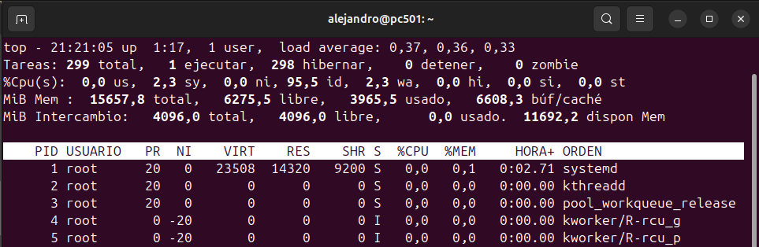
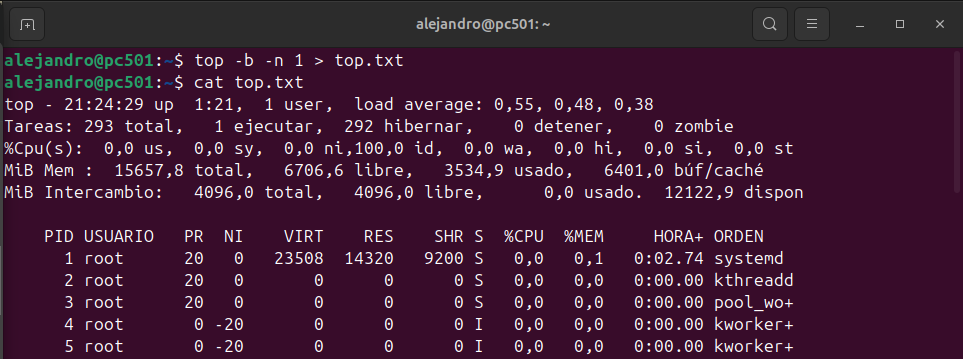
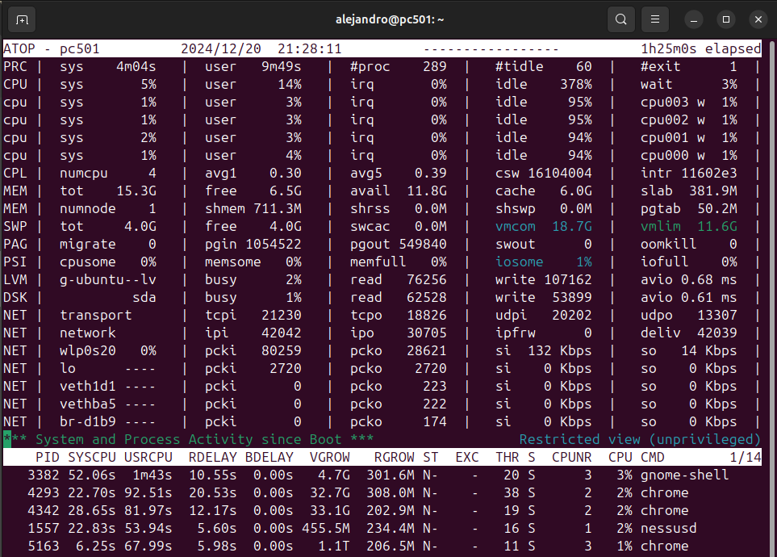
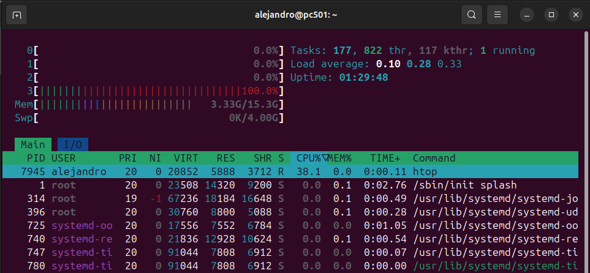
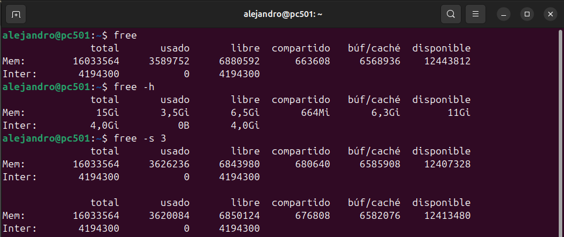
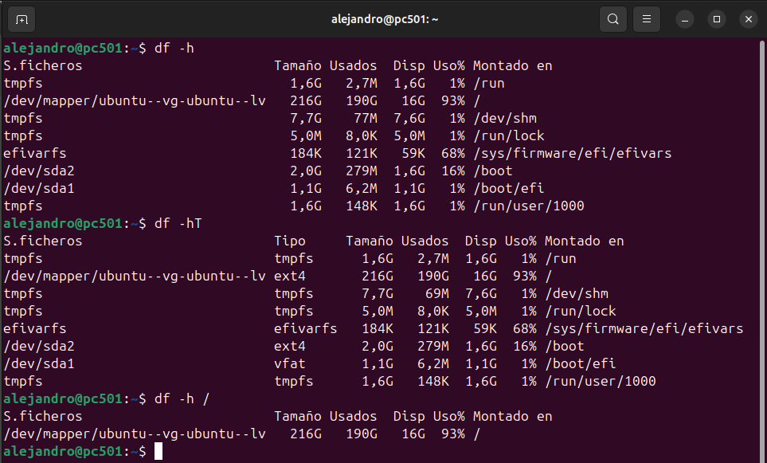
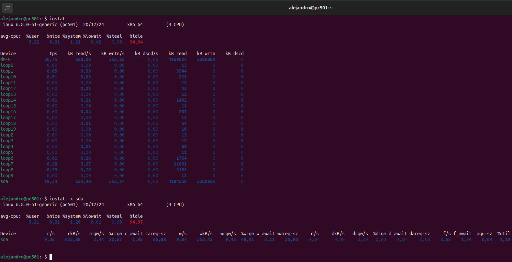

# MONITORIZACIÓN DE PROCESOS

## COMANDO ps aux

> Este comando muestra información detallada de todos los procesos del sistema, incluidos los que no están asociados a terminales, junto con datos como usuario, uso de CPU y memoria.

## COMANDO ps -C nano

> Este comando muestra información específica sobre los procesos cuyo nombre coincida exactamente con `nano`.

## COMANDO ps -eo user,pid,$cpu,%mem,time --sort=-%cpu | head -n 6*

> Este comando muestra los 6 procesos principales (incluyendo el encabezado) ordenados por el uso de CPU en orden descendente, con información del usuario, PID, porcentaje de CPU y memoria utilizada, y el tiempo de ejecución del proceso.

## COMANDO top

> El comando `top` en Linux muestra en tiempo real los procesos en ejecución y el uso de recursos del sistema, como CPU, memoria y carga promedio.

## COMANDO top -b -n 1 > top.txt*

> Este comando ejecuta `top` en modo batch (sin interacción) y captura una sola instantánea de los procesos en ejecución, redirigiendo la salida al archivo **top.txt**

## COMANDO atop

> El comando `atop` en Linux es una herramienta de monitoreo de rendimiento que muestra estadísticas detalladas sobre el uso de recursos del sistema, como CPU, memoria, disco, red y procesos, en tiempo real y con la capacidad de registrar estos datos.

## COMANDO htop

> El comando `htop` en Linux es una herramienta interactiva que muestra una vista en tiempo real de los procesos en ejecución, similar a top, pero con una interfaz más amigable y visual, permitiendo gestionar procesos, ordenar información y ver el uso de recursos como CPU, memoria y red de manera más detallada.

---

# MONITORIZACIÓN DE ALMACENAMIENTO

## COMANDO free

Los comandos free, free -h y free -s 3 en Linux tienen las siguientes funciones:

* `free`: Muestra la cantidad de memoria total, usada, libre y compartida en el sistema, tanto para la memoria RAM como para la memoria de intercambio (swap).

* `free -h`: Muestra la misma información que free, pero con las cifras en un formato legible para el ser humano (usando unidades como MB, GB, etc.).

* `free -s 3`: Muestra la información de la memoria, actualizada cada 3 segundos, permitiendo monitorear en tiempo real el uso de la memoria.

## COMANDO df

Los comandos df -h, df -hT y df -h / en Linux tienen las siguientes funciones:

* `df -h`: Muestra el uso del sistema de archivos en un formato legible para el ser humano (en KB, MB, GB, etc.), mostrando el espacio total, usado, disponible y el punto de montaje.

* `df -hT`: Muestra el uso del sistema de archivos junto con el tipo de sistema de archivos (por ejemplo, ext4, xfs, etc.), en un formato legible para el ser humano.

* `df -h /`: Muestra el uso del sistema de archivos de la raíz ("/"), en formato legible para el ser humano, mostrando el espacio utilizado y disponible en la partición donde está montada la raíz del sistema.

Los comandos iostat e iostat -x sda en Linux tienen las siguientes funciones:

* `iostat`: Muestra estadísticas sobre el uso de CPU y el rendimiento de los dispositivos de entrada/salida (I/O), como discos y particiones, incluyendo datos sobre operaciones de lectura y escritura, tiempo de espera y uso de recursos.

* `iostat -x sda`: Muestra estadísticas extendidas (con más detalles) de I/O específicamente para el dispositivo sda (el primer disco duro o SSD en muchos sistemas Linux), proporcionando información más detallada sobre el rendimiento del dispositivo, como tiempos de espera, latencia y operaciones por segundo.

