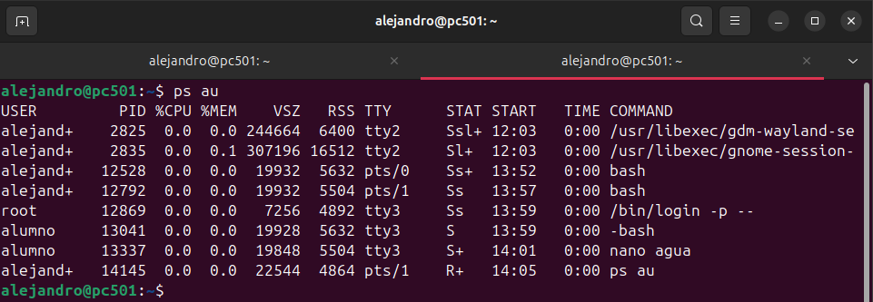

# MONITORIZACIÓN DE PROCESOS

## COMANDO PS

> El comando `ps` en Linux muestra información sobre los procesos en ejecución

*ps a* 

- Este comando muestra información sobre todos los procesos asociados a terminales, incluidos los de otros usuarios.

---

*ps au*

- Este comando muestra información detallada sobre todos los procesos asociados a terminales, incluyendo el usuario, uso de CPU, memoria y otros datos clave.

---

*ps aux*

- Este comando muestra información detallada de todos los procesos del sistema, incluidos los que no están asociados a terminales, junto con datos como usuario, uso de CPU y memoria.

---

*ps -C nano*

- Este comando muestra información específica sobre los procesos cuyo nombre coincida exactamente con `nano`.
