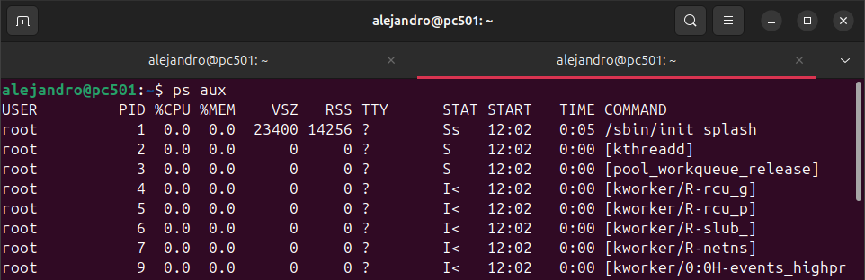
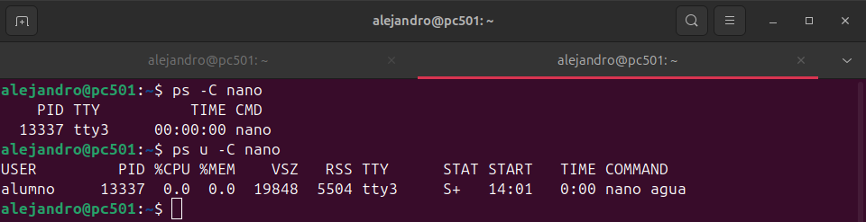
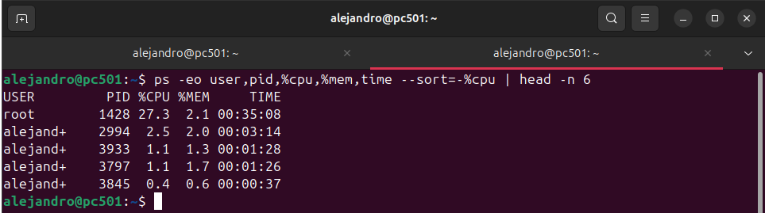

# MONITORIZACIÓN DE PROCESOS

## COMANDO PS

> El comando `ps` en Linux muestra información sobre los procesos en ejecución

*ps aux*

- Este comando muestra información detallada de todos los procesos del sistema, incluidos los que no están asociados a terminales, junto con datos como usuario, uso de CPU y memoria.

---

*ps -C nano*

- Este comando muestra información específica sobre los procesos cuyo nombre coincida exactamente con `nano`.

---

*ps -eo user,pid,$cpu,%mem,time --sort=-%cpu | head -n 6*

- Este comando Muestra los 6 procesos principales (incluyendo el encabezado) ordenados por el uso de CPU en orden descendente, con información del usuario, PID, porcentaje de CPU y memoria utilizada, y el tiempo de ejecución del proceso.
