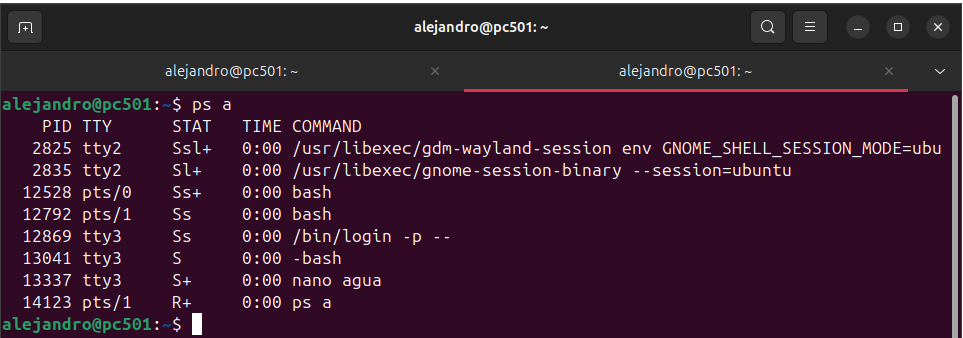

# MONITORIZACIÓN DE PROCESOS

## COMANDO PS

> El comando `ps` en Linux muestra información sobre los procesos en ejecución

*PS A* 

- Este comando muestra información sobre todos los procesos asociados a terminales, incluidos los de otros usuarios.

---

*PS AU*

