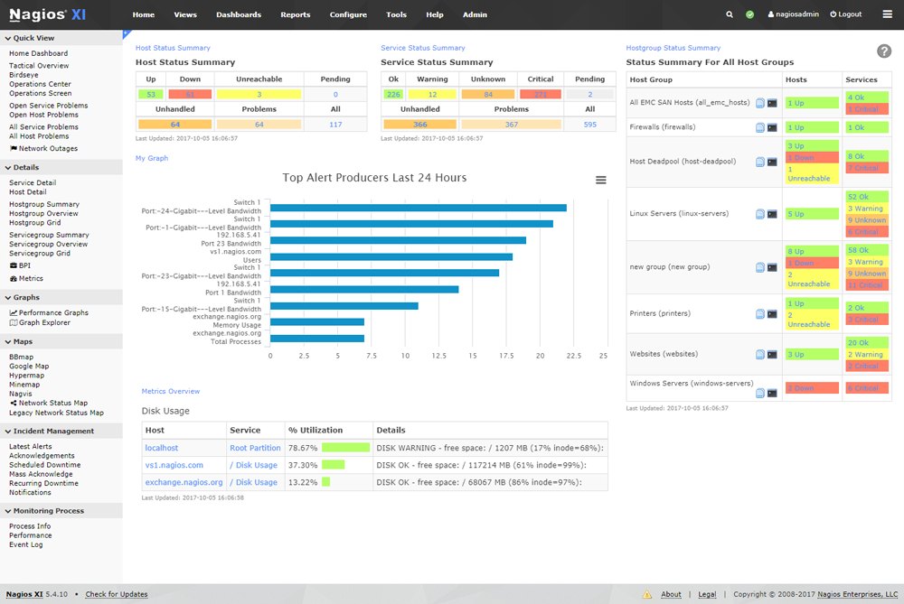
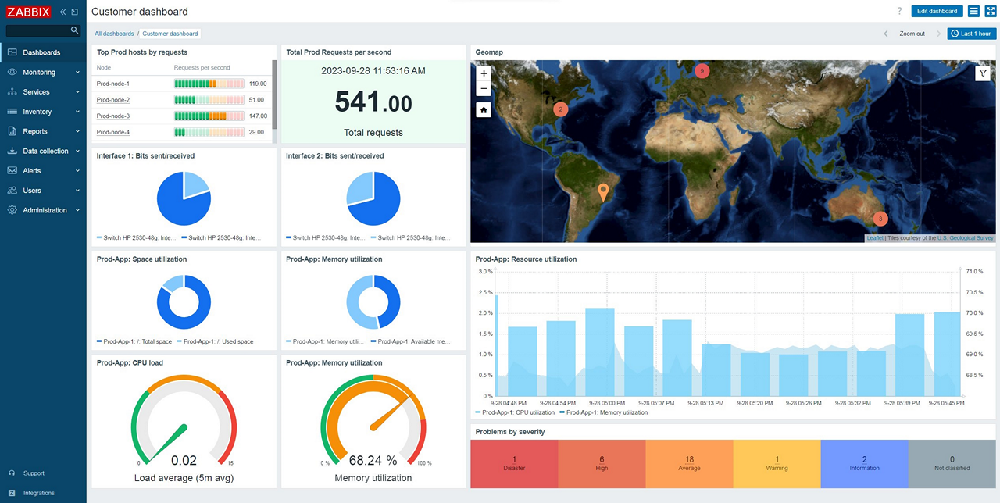
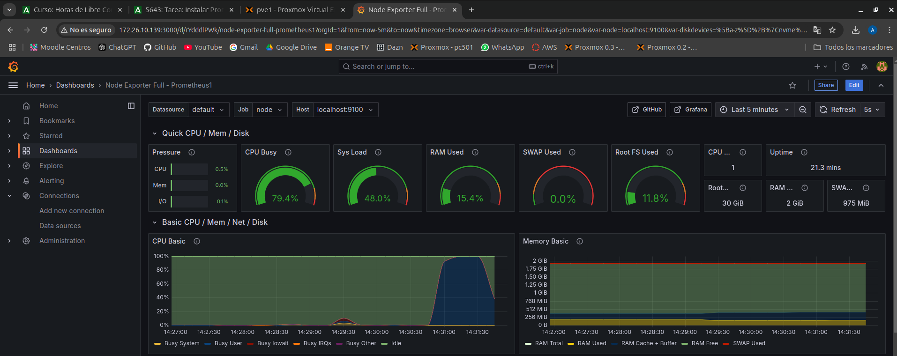

# SISTEMAS DE MONITORIZACIÓN POPULARES

## NAGIOS
> Es una herramienta de monitorización de código abierto que permite supervisar la infraestructura de TI, incluyendo servidores, redes y aplicaciones. Proporciona alertas en tiempo real sobre el estado de los sistemas, como caídas de servicios, sobrecarga de recursos o fallos de hardware.

## ZABBIX
> Es una plataforma de monitorización de código abierto que permite supervisar el rendimiento y la disponibilidad de servidores, redes, aplicaciones y servicios. Proporciona métricas detalladas en tiempo real, como el uso de CPU, memoria, disco y tráfico de red, y permite configurar alertas para notificar a los administradores de posibles problemas.

## PROMETHEUS
> Es un sistema de monitorización y alerta de código abierto diseñado para recopilar y almacenar métricas en series temporales. Se utiliza principalmente para monitorear aplicaciones y servicios, especialmente en entornos dinámicos como contenedores y orquestadores como Kubernetes.
> En este caso he utilizado **Grafana** para la visualización de las métricas.

